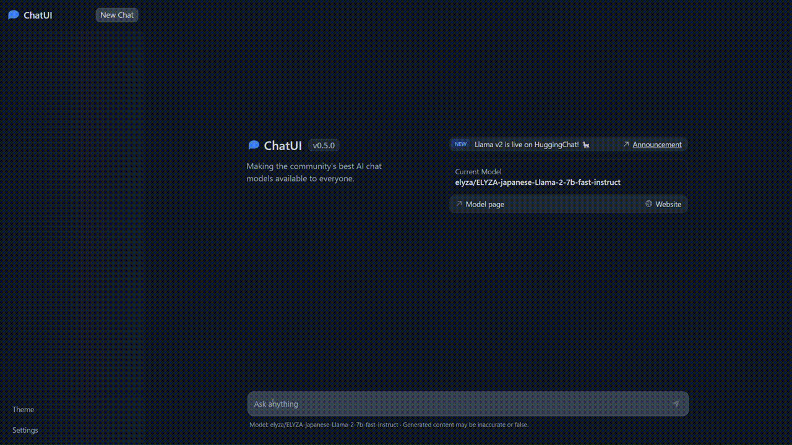

# LLM Chat on AWS

AWS内に完結して動作するLLMチャットを構築します。

## 動作イメージ



続きは[YouTube](https://youtu.be/dBgV30pkbAQ)で公開しています。


## 仕組み

Hugging Faceで公開されているLLMモデルをSageMakerにデプロイします。チャット画面は[OSSで公開](https://github.com/huggingface/chat-ui)されている[HuggingChat](https://huggingface.co/chat/)を使用します。

使用するLLMモデルは[elyza/ELYZA-japanese-Llama-2-7b-fast-instruct](https://huggingface.co/elyza/ELYZA-japanese-Llama-2-7b-fast-instruct)です。Llama2をベースに日本語能力を拡張するための追加学習がさてているとのことです。

## アーキテクチャ

* AWS
  * EC2 (Amazon Linux 2023, t2.small)
  * SageMaker (ml.g4dn.12xlarge)
  * CDK

* ソフトウェア
  * [HuggingChat](https://github.com/huggingface/chat-ui)
  * [elyza/ELYZA-japanese-Llama-2-7b-fast-instruct](https://huggingface.co/elyza/ELYZA-japanese-Llama-2-7b-fast-instruct)
  * [MongoDB](https://hub.docker.com/_/mongo) (on Docker)

MongoDBはチャット履歴の保存に使用されるようです。DocumentDBの採用を検討しましたが、Partialインデックス機能がサポートされていないとのことで利用できませんでした。

また、HuggingChatの実装は、AWSの認証情報（アクセスキー、シークレットキー）をenvファイルに記述する方式となっていましたが、AWS SDKを使用するように一部修正しています。（[コミット](https://github.com/huggingface/chat-ui/commit/c856fe31ad807e62556e39417df410814a4ce424)）


## デプロイ手順

AWS CloudShellで実行します。

* ソースを取得

```shell
mkdir chatui
cd chatui
git clone https://github.com/moritalous/chat-ui.git
```

* デプロイスクリプトを実行

スクリプト内で[SageMakerエンドポイントの作成](aws/sagemaker/create_endpoint.py)と、[CDK](aws/cdk)でVPCとEC2の環境を構築します。EC2内の環境は[ユーザーデータ](aws/cdk/asset/userdata.sh)にてセットアップが実施されます。

```shell
cd chat-ui/aws
sh ./deploy.sh
```

デプロイスクリプト（SageMakerの作成、CDKの実行）は約10分程度で完了します。CDKの完了後にユーザーデータが実行されます。ユーザーデータの完了までは5分ほどかかります。

環境が構築できたら`http://[EC2パブリックドメイン]:80`へアクセスすることでチャットを開始できます。

HTTPS化や認証機能は含まれていませんのでご注意ください。

## 廃棄手順

* 削除スクリプトを実行

```shell
cd chat-ui/aws
sh ./destroy.sh
```
